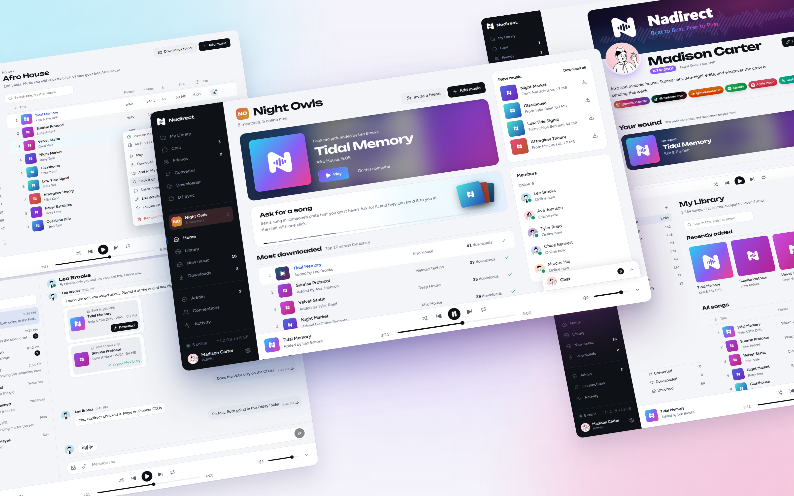
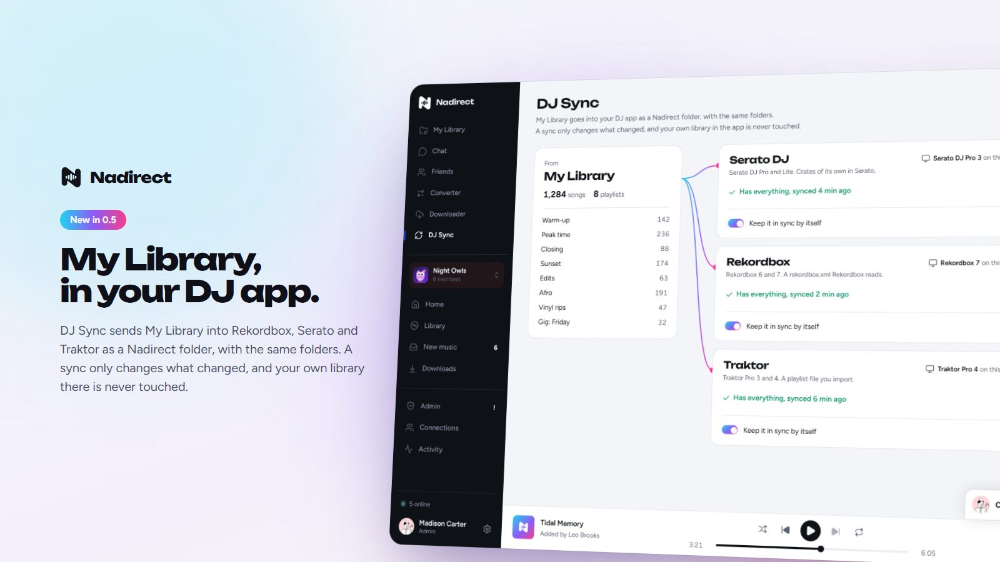
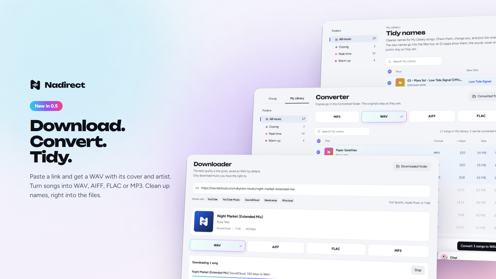
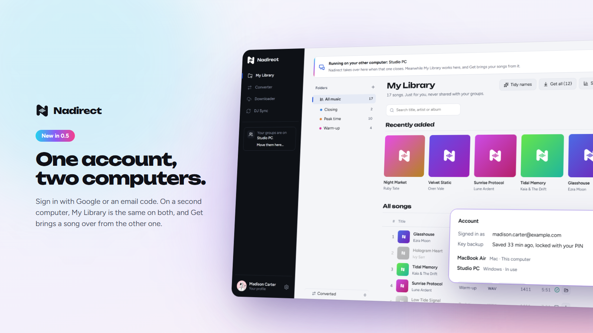
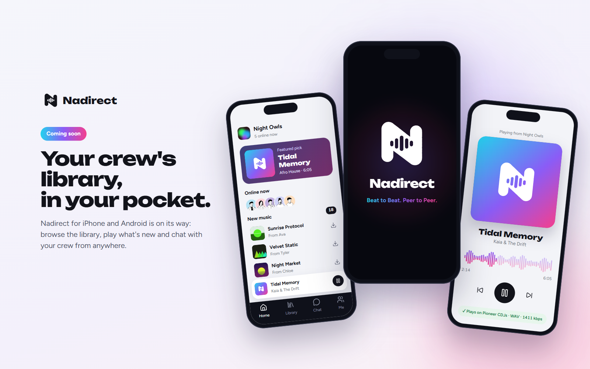

<p align="center">
  <picture>
    <source media="(prefers-color-scheme: dark)" srcset="assets/nadirect-mark-white.svg">
    
  </picture>
</p>

<h1 align="center">Nadirect</h1>

<p align="center"><strong>Beat to Beat. Peer to Peer.</strong></p>

<p align="center">
  <a href="https://github.com/itay5731/Nadirect-releases/releases/latest"></a>
  
  
  
</p>

<h3 align="center">One music library for your whole crew.<br>Straight from computer to computer: your music never touches a server.</h3>

<p align="center"><a href="https://github.com/itay5731/Nadirect-releases/releases/latest"><strong>Download for Windows and macOS</strong></a> · <a href="https://nadirect.co"><strong>nadirect.co</strong></a></p>

Nadirect is for DJ crews who swap tracks all the time. Instead of links in a group chat and folders nobody keeps tidy, everyone adds their music to one library, sorted by the genres you play. Songs go from computer to computer and never pass through a server. And a WAV that won't load on the CDJs gets caught before the gig, not during it.

<p align="center">
  
</p>

## What you get

A library for your group. Everyone adds music into genres your admin sets up (they can nest, like Techno › Dark Techno). You see what's new and download what you want, or let a genre download by itself. A song comes from whoever's online and has it, so it's usually there even when the person who added it isn't.

Songs checked for CDJs. Nadirect looks inside every WAV for the things Pioneer CDJs refuse: 32-bit float, the header that causes E-8305, odd sample rates. One click makes a copy that plays, and your original stays untouched. Other formats get a straight answer too, so FLAC won't catch you out on an older deck.

Sending to one person. Right-click a song (or fifty), choose Send to, and only that person gets them. They can listen before downloading, and the covers come along.

A chat for the group and for each of you. You can see who's online, when someone's typing and when they've read your message. Share songs, photos and videos. If a friend spots something in your crate, they can ask for it right there.

A profile with your crate. Show the list of songs in your library (the files stay with you), your top genres, your socials and a few numbers about your collection.

DJ Sync. My Library goes into Rekordbox, Serato or Traktor as a Nadirect folder, with your folders. A sync sends only what changed, and it can keep itself in sync. Your own library in the app is never touched: not a name, not a cue point. A short guide with pictures sets each app up. In Rekordbox, songs you renamed wait in a Renamed playlist until you choose Reload Tag.

<p align="center">
  
</p>

A downloader. Paste a link to a song or a whole playlist, and it lands in My Library in the format you pick, with its cover and artist. For your own use: only download music you have the right to.

A converter. Turn songs into WAV, AIFF, FLAC or MP3 in one go, covers and details included. The copies go to their own folder, and every WAV plays on CDJs.

Tidy names. Clean names for the whole library: no "Official Video", no track numbers, no shouting. The new names go into the files, and your cue points stay.

<p align="center">
  
</p>

Your account. Sign in once with Google or a code sent to your email. A 6-digit PIN locks a backup of your Nadirect keys, so on a new computer you sign in, type your PIN, and your name, groups and friends come back. Nobody can open the backup without your PIN, not even Nadirect.

Two computers, one library. Sign in on your second computer and My Library is the same on both, sealed between your computers so the server can't read it. A song whose file is on the other computer shows greyed, and Get brings it straight from there. Your groups stay on the first computer you signed in on.

<p align="center">
  
</p>

Folders you already use. Nadirect shares your music from where it already is, and downloads go into plain folders your DJ software can see like any other.

## Privacy

Joining a group needs an invite code and the admin's approval. Songs, group chats, photos and videos go directly between members' computers, encrypted. Nadirect has a small server for your account (your email), friend requests, crate lists and messages waiting for a friend who's offline. Those messages are sealed so only the two of you can read them. Your key backup is locked with your PIN, and the My Library list shared between your own computers is sealed with a key only they have. Every song is checked piece by piece against the original, and only real audio files get through. Updates are signed, and Nadirect asks before installing them.

## Install

1. Download the latest version from [Releases](https://github.com/itay5731/Nadirect-releases/releases/latest).
2. On Windows, run `Nadirect-Setup-x.y.z.exe`. If Windows asks about network access, choose Allow.
3. On a Mac (Apple Silicon or Intel), open `Nadirect-x.y.z-mac.dmg` and drag Nadirect into Applications. Allow incoming connections when asked.
4. The first time you open Nadirect, Windows or macOS asks you to confirm (see the FAQ below).
5. Sign in with Google or a code sent to your email, and choose a 6-digit PIN.
6. Create a group, or paste the invite code a friend sent you.

Nadirect updates itself: it tells you what's new and installs when you say so.

## Coming to your phone

<p align="center">
  
</p>

Nadirect for iPhone and Android is on its way.

## FAQ

<details>
<summary>Do my songs go through a server?</summary>
<br>
No. They go from one member's computer to another's. The server only handles your account, friend requests, crate lists and messages waiting for someone who's offline.
</details>

<details>
<summary>Can Nadirect see my music or messages?</summary>
<br>
No. Songs, group chats, photos and videos go straight between computers, encrypted. A message waiting for someone offline is sealed so only the two of you can read it. Your account is just your email, and the My Library list shared between your own computers is sealed with a key only they have.
</details>

<details>
<summary>What if the person who added a song is offline?</summary>
<br>
In a group, you get it from anyone online who has it. A song someone sent only to you comes from their computer, so it downloads the next time you're both online.
</details>

<details>
<summary>Does it work with Rekordbox, Serato or Traktor?</summary>
<br>
Yes. DJ Sync sends My Library into Rekordbox 6 and 7, Serato DJ Pro and Lite, or Traktor Pro 3 and 4 as a Nadirect folder with your folders, and a sync sends only what changed. Your own library in the app is never touched, and a short guide sets each one up. In Rekordbox, songs you renamed wait in a Renamed playlist: select them all there and choose Reload Tag.
</details>

<details>
<summary>Can I download from a link?</summary>
<br>
Yes. Paste a link from YouTube, SoundCloud, Bandcamp or Mixcloud, a song or a whole playlist, and it lands in My Library as WAV (or AIFF, FLAC or MP3), with its cover and artist. It's for your own use: only download music you have the right to.
</details>

<details>
<summary>Does converting lose quality?</summary>
<br>
Not to WAV, AIFF or FLAC: the sound is kept exactly as it is, and the file just takes more room. MP3 is saved at 320 kbps, the most an MP3 holds. Your originals are never changed.
</details>

<details>
<summary>Does Tidy names change my files?</summary>
<br>
Only the title and artist inside them. The sound, the cover, the file name and your cue points and beat grids stay exactly as they were, and Undo puts the old names back.
</details>

<details>
<summary>Which formats work?</summary>
<br>
MP3, WAV, AIFF, FLAC, M4A (AAC and ALAC), OGG and Opus.
</details>

<details>
<summary>Do I need an account?</summary>
<br>
Yes, one sign-in with Google or a code sent to your email. The account is your email, nothing more. If you already use Nadirect, your groups, friends, chat and My Library join it.
</details>

<details>
<summary>What if I get a new computer?</summary>
<br>
Sign in there and type your 6-digit PIN. It unlocks a backup of your Nadirect keys, so your name, groups and friends come back. Nobody can open that backup without your PIN, not even Nadirect.
</details>

<details>
<summary>Can I use Nadirect on two computers?</summary>
<br>
Yes. Sign in on both and My Library is the same on each. A song whose file is on the other computer shows greyed, and Get brings it straight from there. Your groups stay on the first computer you signed in on, and one computer at a time is in your chat.
</details>

<details>
<summary>Will it slow my internet down?</summary>
<br>
You decide how much upload to share (2 MB/s to start), how many people can download from you at once, and when. You can pause sharing any time.
</details>

<details>
<summary>Can people outside my group see my music?</summary>
<br>
No. Only members see the group's library. Your crate list is only shown if you turn it on, and to whoever you choose.
</details>

<details>
<summary>Is it safe to download songs from other people?</summary>
<br>
Nadirect checks every file piece by piece against the original, lets through only real audio files, and never opens or runs anything it downloads. Still, only join groups and add friends you know, and download from people you trust.
</details>

<details>
<summary>Opening Nadirect for the first time</summary>
<br>

Nadirect just isn't signed yet, so Windows and macOS ask you to confirm the first time you open it. After that it opens like any other app.

**Windows:** if you see "Windows protected your PC", click More info, then Run anyway.

**macOS:** if macOS says it can't check the app for malware, click Done, then open System Settings › Privacy & Security, scroll down and click Open Anyway. Confirm with your password. If it says the app is damaged, run this in Terminal and open it again:

```
xattr -cr /Applications/Nadirect.app
```
</details>

## Sharing music

Only share music you're allowed to share: your own, music whose licence allows it, or music the owner said you can share. Nadirect never sees or stores your music, and each member is responsible for what they add. The full terms are in the app under Settings.

## License

Nadirect is free to download and use, but it isn't open source. © 2026 Itay Nadir, all rights reserved. See [LICENSE](LICENSE).
