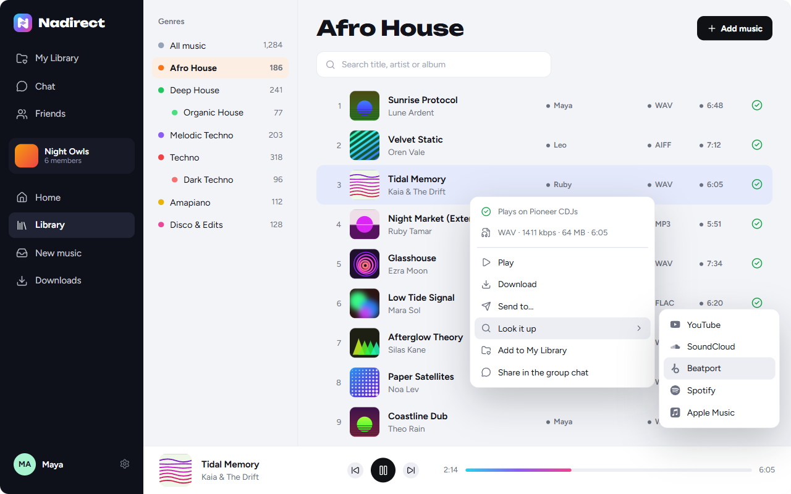
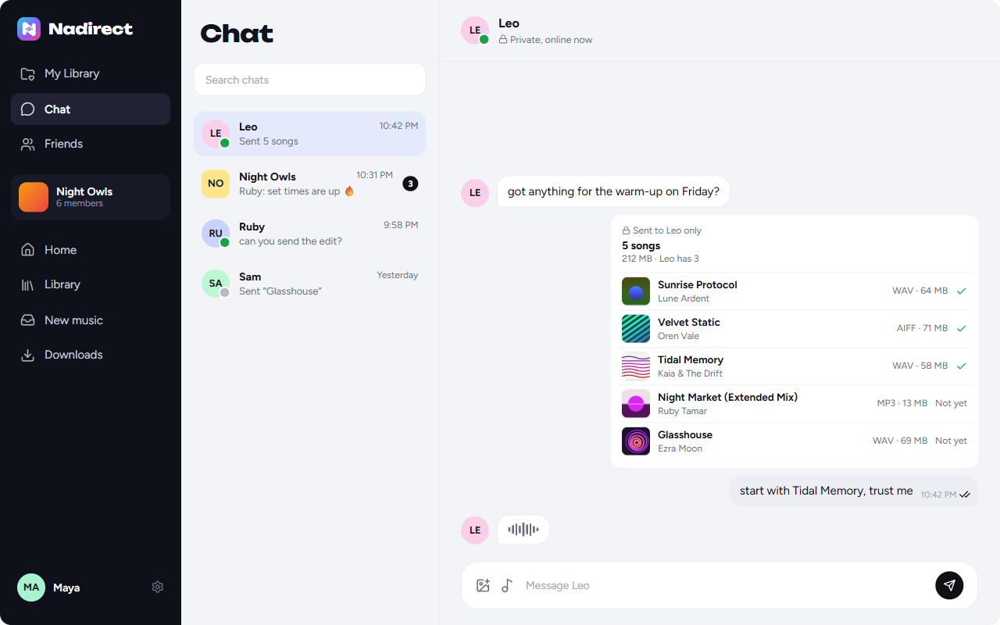
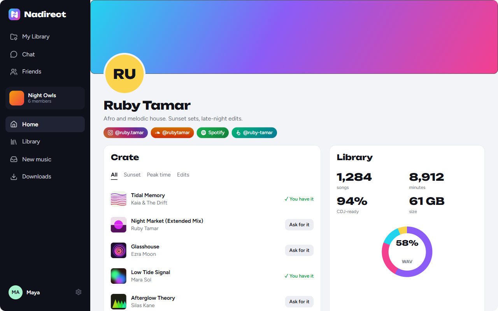

<p align="center">
  <picture>
    <source media="(prefers-color-scheme: dark)" srcset="assets/nadirect-mark-white.svg">
    
  </picture>
</p>

<h1 align="center">Nadirect</h1>

<p align="center"><strong>Beat to Beat. Peer to Peer.</strong></p>

<p align="center">
  <a href="https://github.com/itay5731/Nadirect-releases/releases/latest"></a>
  
  
  
</p>

<h3 align="center">One music library for your whole crew.<br>Straight from computer to computer: your music never touches a server.</h3>

<p align="center">
  <a href="https://github.com/itay5731/Nadirect-releases/releases/latest"><strong>⬇ Download Nadirect for Windows and macOS</strong></a>
</p>

<p align="center">
  
</p>

---

## Why DJs switch to Nadirect

|  | |
|---|---|
| 🎧 **Your crew's crates, together** | Everyone adds their music, everyone sees it, sorted into the genres your crew actually plays. |
| 🔒 **Nobody in the middle** | Songs go straight from one computer to another. They never touch a server, a cloud or us. |
| 🎛️ **Ready for the decks** | Every song gets a CDJ check, and a problem WAV is fixed in one click, before the gig finds out for you. |

## ✨ New: send a song to one person

<p align="center">
  
</p>

Not everything is for the whole group. Now a track can go to **one friend only**:

- **Send to…** Right-click any songs, pick a friend, done. Send one or fifty: they arrive as one neat box, with **Download all**.
- **Hear it first.** Your friend can press play and listen before downloading, straight from your computer.
- **Covers and all.** It lands in their library with the artwork, ready to play.
- **Ask for it.** Spot a track in a friend's crate? Ask, and they send it with one click.

## A chat that feels alive

- **See who's online**, watch the little waveform while they're **typing**, and know they've **seen** it with two ticks.
- Share songs your friends can play right there, plus photos, videos, replies and reactions.
- A small chat window follows you around the app, so you never miss a request.

## Built for the booth

- **A CDJ check on every song.** WAVs are checked inside the file for what makes a CDJ refuse it: 32-bit float audio, the header behind error **E-8305**, sample rates CDJs can't play, surround. Every other format gets a clear answer too.
- **One-click fix for WAVs.** A CDJ-ready copy with the same name, your original untouched.
- **Everything at a glance.** Right-click any song for format, bitrate, size, length and whether it plays on every CDJ.
- **Look it up.** Straight to YouTube, SoundCloud, Beatport, Spotify or Apple Music.
- **Works with your software.** Downloads go into plain genre folders you can point Rekordbox, Serato or Traktor at.

## Show off your taste

<p align="center">
  
</p>

- **Your profile:** a banner, your top genres, your socials and the track you're featuring.
- **Your crate:** share your library's list with friends (never the files) and let them ask for what they like.
- **Your numbers:** songs, minutes, formats, top artists and how much is CDJ-ready.

## Your library, your rules

- **Download only what you want.** New music shows up in one place: take it, skip it, or let a genre download by itself.
- **Always there.** A song comes from anyone online who has it, and big files come from several friends at once.
- **Easy on your connection.** You choose how much upload to share, and can pause any time.
- **Your files stay put.** Nadirect shares your music from where it already is. Nothing is copied or moved.

## Private by design

- **Invite only.** Joining a group takes an invite code *and* an admin's approval.
- **Your music never touches a server.** Songs, group chats, photos and videos go directly between members' computers, encrypted end to end.
- **Only the two of you.** Private messages are sealed so nobody else can read them, not even Nadirect.
- **Every file is checked.** Each piece of a song is verified against the original's fingerprint, and only real audio files are accepted.
- **Signed updates.** Nadirect only installs updates that carry our signature, and asks you first.

## Get started in a minute

1. **[Download the latest version](https://github.com/itay5731/Nadirect-releases/releases/latest).**
2. **Windows:** run `Nadirect-Setup-x.y.z.exe`. When Windows asks about the network, choose **Allow**.<br>
   **macOS** (Apple Silicon and Intel): open `Nadirect-x.y.z-mac.dmg` and drag Nadirect into Applications. The first time, right-click it in Applications and choose **Open**, then **Open** again. When it asks about incoming connections, choose **Allow**.
3. **Create a group** for your crew, or paste an invite code a friend sent you.

Updates arrive by themselves: Nadirect shows what's new and installs when you say so. Every version's notes are in **Settings → Updates → What's new**.

## FAQ

<details>
<summary><strong>Do my songs go through a server?</strong></summary>
<br>
Never. Songs, photos and group chats go straight between your crew's computers. Nadirect's server only helps with the small stuff that has to work while you're offline: your friends list, the list of songs in your crate, and messages waiting for a friend (sealed, so the server can't read them).
</details>

<details>
<summary><strong>What if the friend who added a song is offline?</strong></summary>
<br>
In a group, you get it from anyone online who has it, not only the person who added it. A song sent to you alone comes from the sender's computer, so it downloads the next time you're both online. You'll see "Waiting for them to be online" until then.
</details>

<details>
<summary><strong>Does it work with Rekordbox, Serato and Traktor?</strong></summary>
<br>
Yes. Downloads land in plain folders, one per genre, in your Music folder. Point your DJ software at them like any other folder.
</details>

<details>
<summary><strong>Which formats can I share?</strong></summary>
<br>
MP3, WAV, AIFF, FLAC, M4A (AAC and ALAC), OGG and Opus. Every file is checked to be real audio before anyone gets it.
</details>

<details>
<summary><strong>What does "CDJ-ready" mean?</strong></summary>
<br>
That the file plays on Pioneer CDJs. WAVs are checked inside the file; MP3, AAC and AIFF play on every CDJ, FLAC and ALAC only on the CDJ-3000 and NXS2, and OGG and Opus not at all. A WAV that would fail can be fixed in one click.
</details>

<details>
<summary><strong>Will it slow down my internet?</strong></summary>
<br>
No. You choose how much upload to share (2 MB/s to start with), how many friends can download from you at once, and you can pause sharing any time, or share only during certain hours.
</details>

<details>
<summary><strong>Can people outside my group see my music?</strong></summary>
<br>
No. Your group's library is for its members only. Your crate (just the list of songs, never the files) is shown only if you turn it on, to your friends or to everyone you choose.
</details>

<details>
<summary><strong>macOS says Nadirect is damaged. What now?</strong></summary>
<br>
The app isn't signed with an Apple developer account yet. Run this in Terminal, then open it again:

```
xattr -cr /Applications/Nadirect.app
```
</details>

## Share fairly

Only share music you have the right to share: music you made, music whose licence allows sharing, or music the rights holder said you can share. Nadirect never sees or stores your music; every member is responsible for what they add. The full terms are in the app, under **Settings**.

## License

Nadirect is free to download and use. The app and its code are © Itay Nadir, all rights reserved; it isn't open source. Using Nadirect means agreeing to the terms in the app, under **Settings**.

---

<p align="center"><strong>Nadirect</strong> · Beat to Beat. Peer to Peer.<br>
<a href="https://github.com/itay5731/Nadirect-releases/releases/latest">Download now</a></p>
